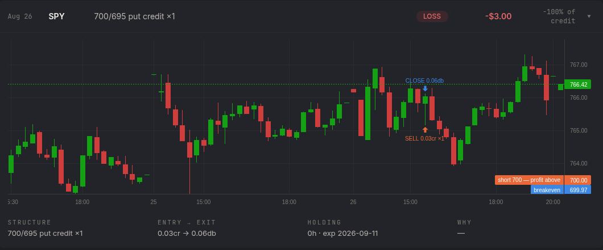
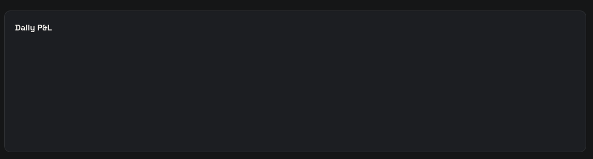
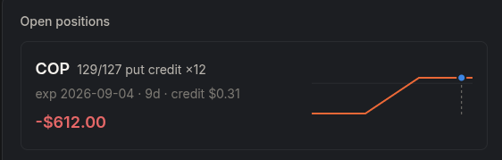

# Plan — fix churn exits, entry-gate leaks, and three dashboard defects

> **Status: EXECUTED 2026-08-26, with corrections.** The step-1 diagnostic
> resolved the incident on the live host: the SPY 700/695 trade was a manual
> CLI smoke test (`client_order_id = tf-smoke-cli-001`, submitted 46 s before
> commit `213f1ac`), not an agent decision. Findings B and C are therefore
> void *as causes of this incident* — the parent and leg fills agree (0.03),
> the fill beat its −0.01 limit legally, and the selector never ran on those
> strikes. The code defects described below were verified real and fixed:
> steps 1–3 and 5–8 in full; step 4 scoped to the verified bugs (crossed
> quotes, open interest, penny-rescue branch, entry_limit emission), with the
> delta-vs-price cross-check and short-leg bid floor deliberately deferred.
> Incident record and the new no-manual-orders rule: `docs/OPERATIONS.md`.

## Context

A trade on the dashboard triggered this review:

`SPY 700/695 put credit ×1`, entry `0.03cr` → exit `0.06db`, holding `0h`,
realized `-$3.00` ("-100% of credit"), with SPY spot at ~766 and 16 DTE. Two
questions came out of it — why did the agent enter and exit almost instantly,
and why does the chart give no room to see it — and two more followed from the
same session review: the Daily P&L card renders an empty box, and the open
positions cards are too terse to read.

Investigation found these are **five independent defects**, not one. Three are
real trading-logic bugs that cost money; three are dashboard bugs. They are
grouped below in the order they should be fixed, because the diagnostic informs
how hard to tighten the entry gates.

---

## Findings

### A. The exit band is credit-relative with no absolute floor — this is the churn

`agent/execution/monitor.py:99-121` (`evaluate_exit`) expresses every threshold
as a multiple of the entry credit:

- profit target: `cost <= entry_credit * (1 - 0.50)`
- stop: `loss >= 2.0 * entry_credit`

The monitor pass runs **every 60 seconds** (`agent/main.py:38`,
`MONITOR_INTERVAL_S = 60`). With a credit of ~0.03 the entire decision band is
about eight cents wide — narrower than one leg's bid/ask — so ordinary quote
noise satisfies an exit rule on the very next pass.
`cost = round(short_mid - long_mid, 2)` amplifies this: on a deep-OTM pair the
two mids are nearly equal and the rounding alone moves the result by a full
cent.

The exit limit at `agent/run_monitor.py:135`, `round(cost * 1.02 + 0.01, 2)`,
is likewise unfloored — with `cost ≈ 0.05` it produces exactly the `0.06` debit
observed.

**This does not contradict the strategy docs.** `docs/STRATEGY.md:32-35` and
`docs/pdt-rule-change-2026.md:56-62` endorse closing *a spread that reaches its
profit target* the same session. They are about a genuine target being hit, not
about noise. The fix is an absolute floor on the band, **not** a
minimum-holding-time lock — a time lock would reverse a documented decision and
would also delay legitimate stops.

### B. `entry_credit` has three disagreeing definitions

- `agent/execution/monitor.py:90-92` — `reconstruct_spreads` derives it from
  **broker positions**: `round(short.avg_entry_price - long.avg_entry_price, 2)`.
- `agent/journal.py:92` — `pair_round_trips` derives it from the **parent mleg
  order**: `abs(float(order["filled_avg_price"]))`.
- `dashboard/app/api/snapshot/route.ts:82` — a **third** implementation, in
  TypeScript, re-deriving it from `avg_entry_price` again for the
  open-positions cards.

The exit *decision* uses the first; the dashboard *P&L* uses the second. They
can differ by a cent or more, and that gap explains the incident arithmetic:
the journal recorded 0.03, but a monitor-side credit of ~0.01 puts the 2× stop
at `cost >= 0.03`, which `cost ≈ 0.05` trips — producing the 0.06 exit limit
that was filled.

### C. Entry gates that should have made this spread impossible did not fire

A SPY 700 put with spot 766 and 16 DTE is roughly 0.01 delta and worth pennies.
Yet `agent/options/selector.py:107-145` already requires
`min_short_delta=0.15`, `credit >= 0.15`, and `credit / width >= 0.12` — on a
$5 width that last one demands **credit ≥ 0.60**. Three observations:

1. Both surviving gates consume `_mid(quote)` (`selector.py:53-58`, which only
   rejects `None` and non-positive bids) and `greeks.delta`. A stale, crossed,
   or one-sided quote poisons both at once. **Strongest single-root-cause
   candidate: a crossed quote.** `selector.py:67` computes `spread = ask − bid`
   with no `ask >= bid` check — an inverted quote (e.g. bid 1.20 / ask 0.03)
   yields a *negative* spread that satisfies `spread/mid <= 0.25` **and**
   `spread <= 0.10` unconditionally, while `_mid` happily averages it to a
   plausible credit above `min_credit_usd`. One bad tick defeats the credit
   gate and the liquidity gate simultaneously.
2. `is_tradable` (`selector.py:61-67`) passes a quote if **either**
   `spread/mid <= 0.25` **or** `spread <= 0.10` absolute. The absolute branch
   waves through any penny contract quoted e.g. `0.01/0.10`.
3. **`min_open_interest: 500` is declared at `agent/config.py:37` and never
   read anywhere in the codebase** (verified by full-repo grep — one hit, the
   declaration itself). `docs/STRATEGY.md:26` advertises "open interest ≥
   500/leg" as an enforced gate. It is not implemented at all.

The entry submission path cannot itself turn 0.58 into 0.03 —
`run_scan.py:89-93` submits `credit_mid - concession`, `credit_mid >=
min_credit_usd = 0.15` by the gate at `selector.py:141`, and `broker.py:119`
sends `limit_price = -abs(limit_credit)` (negative = net credit), so a limit
sell fills at limit or better: **the lowest submittable entry limit this
codebase can produce is ~0.14**. Therefore a 0.03 "entry credit" is one of
(a) the parent mleg `filled_avg_price` not being the net credit (accounting
artifact), or (b) the paper simulator filling below the limit / mishandling the
negative sign. **Finding A's fix is correct either way; finding C's severity
depends on the answer**, which is why the diagnostic comes first.

Corroboration that the strike was structurally impossible:
`docs/alpaca-notes.md` records, for this exact expiry (2026-09-11), SPY 749 as
the ~25Δ strike at 18 DTE — the incident's 700 is ~10 strikes below the band.
And `target_width(766) = 9.19` yet the trade is $5 wide, so either the chain
returned only $5 increments that far OTM or the chain dict was truncated —
worth a diagnostic column (strike count + spacing returned).

Auditability gap: `run_scan.py:95-99` emits `order_open` with
`credit=spread.credit_mid` and `delta=spread.short_delta`, but never the
submitted `entry_limit` and never a fill price. The event log alone cannot
adjudicate selected-vs-filled.

### D. Daily P&L renders an empty box — the chart is never initialized

`dashboard/components/DailyPnl.tsx` returns `null` while `days.length === 0`
(line 75), so on first render the `div` carrying `ref` is **never mounted** and
`ref.current` stays null. The init effect that would call
`echarts.init(ref.current)` bails out — and its dependency array is `[]`, so it
never runs again once the data arrives. `chart.current` stays null forever, the
`setOption` effect always returns early, and the box stays blank permanently.
The heading renders because `days.length >= 1` after the fetch.

`dashboard/components/EquityChart.tsx:56-69` already does this correctly — its
init effect is keyed on `[hasData]`. That is the pattern to copy.

Secondary: `dashboard/app/api/daily-pnl/route.ts` filters
`d.date < todayKey && d.pl !== 0`, so a young paper account with a flat history
yields only the single live "today" bar.

### E. The trade chart cannot be zoomed, and the window is three days wide

- `dashboard/components/TradeDetail.tsx:55` sends `&tf=${tf}`, but
  `dashboard/app/api/bars/route.ts:17` **ignores it and hardcodes
  `timeframe=15Min`**. The 5m/15m/30m/1h/1d buttons are dead — `tf` is in the
  effect deps, so clicking refetches and re-renders identical data.
- `TradeDetail.tsx:48-50` builds the window as
  `open − 2 days → min(close + 1 day, now − 16min)` then calls `fitContent()`.
  For a minutes-long trade that is ~3 days of 15-minute candles, so entry and
  exit markers land on adjacent candles.
- `TradeDetail.tsx:148-150` computes holding as
  `Math.round(ms / 3_600_000) + "h"`, so anything under 30 minutes displays as
  `0h`.
- **And the reason no zoom would survive anyway:** `TradeHistory.tsx` refetches
  `/api/trades` every 30 s and hands `TradeDetail` a *new `trade` object by
  reference*; `TradeDetail.tsx:138` has `trade` in the effect deps, so the
  chart is destroyed and rebuilt with `fitContent()` **every 30 seconds**. Any
  zoom the user performs is wiped twice a minute. The deps must be the scalar
  fields (`open_order_id`, `open_ts`, `close_ts`, strikes, credit), not the
  object.

### F. Open positions are too terse

`dashboard/components/Dashboard.tsx:141-193` renders each spread as a fixed
card with a 180×64 `PayoffDiagram`. There is no way to see price levels,
breakeven, max profit/loss, or where the live price sits relative to them.

**Requested UX (from review):** a Webull-style position detail. If the full
detail is too much for the card itself, the card should expand in place and
show the price levels and every characteristic of the credit spread, with the
moving live price marking the current P&L and the P&L levels.

---

## Plan

### 1. Diagnostic first — answer "was 0.03 a real fill?" (`scripts/diagnose_trade.py`, new)

A **read-only** script, committed to the repo and run on the live host, that
for a given underlying (or the last N round trips) prints side by side:

| source | field |
| --- | --- |
| `logs/events.jsonl` `order_open` | `credit`, `delta`, `max_risk` |
| Alpaca `/v2/orders?...&nested=true` parent | `filled_avg_price`, `limit_price` |
| same, **each leg** | `symbol`, `filled_avg_price`, `filled_qty` |
| `data/thetaforge.db` `trades` row | `entry_credit`, `exit_debit`, `realized_pl` |
| `reconstruct_spreads` | what the monitor would compute today |

Reuse existing primitives — add no new broker methods: `Broker._headers()`
(`broker.py:60`), the closed-orders REST pattern at `run_monitor.py:29-36`,
`Broker.option_positions()` (`broker.py:143`),
`agent/execution/monitor.py:parse_occ`, `agent/journal.connect`,
`agent/events.tail`.

The script must send no orders and open no write transactions.

Include the **parent order's own `limit_price`** as a column — it is already
in the closed-orders JSON, so the submitted limit is trivially recoverable
without the event log. The script should print explicit per-trade verdict
flags rather than leaving interpretation to the reader:

| flag | condition | conclusion |
| --- | --- | --- |
| `PARENT_NE_LEGS` | parent `filled_avg_price` ≠ short − long leg fills (±0.005) | 0.03 is an accounting artifact |
| `FILL_BELOW_LIMIT` | opening fill < submitted limit − 0.005 | simulator ignored the limit |
| `DELTA_OOB` | event delta outside the configured band | delta gate bypassed |
| `RATIO_LT_FLOOR` | credit / width < `min_credit_to_width` | credit-to-width gate bypassed |
| `MONITOR_JOURNAL_DIVERGE` | reconstructed vs journal credit differ > 0.01 | finding B, quantified |

A second mode (`--chain SPY`) re-runs the live chain request and dumps, per
strike: bid/ask/mid, crossed?, quote age, delta, which `is_tradable` branch
passed, credit and credit÷width — plus `len(chain)` and observed strike
spacing, so a truncated chain is visible. To avoid logic drift, refactor the
loop body of `build_put_credit_spread` into a `_trace_candidates(...)`
generator (yielding symbol/strike/delta/mid/reject-reason); the selector
consumes it and takes the best non-rejected candidate, the diagnostic prints
all of them.

**This gates step 4.** If the fill was genuinely 0.03, the selector let a
0.01-delta strike through and step 4 is mandatory. If the fill was ~0.58 and
the journal misread it, then finding B is the primary bug and every P&L number
on the dashboard is wrong.

### 2. Absolute floor on the exit band (`agent/config.py`, `agent/execution/monitor.py`, `agent/run_monitor.py`)

New `StrategyConfig` fields:

- `min_exit_band_usd: float = 0.10` — the profit-target and stop thresholds
  must each sit at least this far from the entry credit. Chosen to exceed a
  typical one-cent-per-leg quote flicker plus the `round(..., 2)` error,
  without swallowing a real $5-wide move.
- `min_exit_limit_usd: float = 0.02` — floor for the closing limit at
  `run_monitor.py:135`, so a near-zero `cost` cannot produce an absurd limit.

`evaluate_exit` changes: keep the existing precedence (**time stop > stop >
profit target**), but widen each credit-relative threshold to at least
`min_exit_band_usd` away from `entry_credit` before comparing. Concretely, the
stop fires at `loss >= max(stop_loss_credit_mult * entry_credit,
min_exit_band_usd)` and the target at
`cost <= entry_credit - max(profit_target_pct * entry_credit, min_exit_band_usd)`.

**Degenerate case** — a credit so small that the floored target is negative
(i.e. no achievable profitable exit): **hold it, loudly**. Closing a
0.03-credit spread means crossing a bid/ask wider than the entire position
value — paying ~100% of the credit to exit, which is precisely the observed
`-$3.00 / -100%`. The risk is already defined and fully collateralized, and
the 2-DTE time stop retires it for free; holding is strictly cheaper in
expectation than deliberately crossing. The floored stop still governs a
genuine adverse move. Emit a new `position_unmanageable` event naming the
symbol and credit so it surfaces in the brain feed — this makes finding C
visible in production instead of silent.

Two hardenings that fall out of the same review:

- **Zero/negative credit guard.** Today a zero or negative *reconstructed*
  credit (assigned leg, partial fill) makes `loss >= 0` fire the stop
  **instantly**. Guard `entry_credit <= 0` → HOLD with an explicit flag before
  any rule runs.
- **Cap the exit limit at the spread's width.** Extract `run_monitor.py:135`
  into a testable `exit_limit(cost, width, strategy)` with
  `pad = max(min_exit_limit_usd, 2% of cost)` and
  `limit = min(cost + pad, width)` — you can never rationally pay more than
  width to close. Requires carrying `width` (and `opened_at`, for
  observability only — **not** as an exit rule) on `OpenSpread`.

Adding an event type requires two edits in
`dashboard/components/BrainFeed.tsx`: an entry in the `COLORS` map (line 11-21)
and a `case` in `line()` (line 39-66). Without them the event falls through to
`default: JSON.stringify(e)` and renders as raw JSON.

### 3. One definition of `entry_credit` (`agent/execution/monitor.py`, `agent/journal.py`)

Single source of truth: **the opening order's LEG fills**,
`short.filled_avg_price − long.filled_avg_price` — because (a) it is what
actually happened, unlike `credit_mid`; (b) it is unambiguous, unlike the
parent's `filled_avg_price`, whose semantics the step-1 diagnostic will
confirm; (c) it is exactly what `avg_entry_price` should equal, so monitor and
journal converge by construction. Direction of the fix is journal → monitor,
never the reverse: positions vanish the instant a trade closes, fills are
permanent.

- New pure `journal.net_credit(order) -> float`: prefer the leg difference when
  both legs carry `filled_avg_price`, else fall back to
  `abs(parent["filled_avg_price"])`. The fallback is the compatibility hinge —
  `tests/test_journal.py`'s fixtures emit no per-leg prices, so they take the
  fallback path untouched. Emit a `journal_price_mismatch` event when legs and
  parent differ by > 0.01.
- `reconstruct_spreads` accepts an optional journal-credits index, prefers it,
  and falls back to `avg_entry_price` as today; record the source so it lands
  in the HOLD/CLOSE reason string. Note `run_monitor.py` already reconciles the
  journal *before* reconstructing (lines 36 → 41) — that ordering is currently
  accidental and must be pinned with a comment.

The dashboard's third copy (`snapshot/route.ts:82`) should read the journal's
value too, so the open-position cards, the closed-trade P&L, and the agent's
own exit decision all quote the same number.

`tests/test_journal.py` fixtures (`filled_avg_price="-1.13"` opens / `"0.55"`
closes) must keep passing unchanged.

### 4. Harden entry selection (`agent/options/selector.py`, `agent/config.py`, `agent/run_scan.py`)

Scope depends on step 1's answer; do all of these if the fill was real:

- **Enforce `min_open_interest`.** It is declared at `config.py:37` and
  documented at `docs/STRATEGY.md:26` but never read. Wire it into the per-leg
  check in `build_put_credit_spread`, skipping the contract when the chain
  snapshot lacks an OI field rather than defaulting to pass.
- **Quote sanity before trusting `_mid`** (`selector.py:53-58`): reject crossed
  quotes (`bid > ask`), and reject a quote whose absolute width alone exceeds
  the credit the spread would collect.
- **Gate the absolute branch of `is_tradable`** (`selector.py:61-67`) so
  `spread <= 0.10` cannot rescue a contract whose mid is itself near zero — the
  branch exists for cheap *but real* contracts, not for penny dust.
- **Sanity-check `greeks.delta` — price cross-check as primary, moneyness as
  backstop.** Primary: reject when the short leg's mid is below ~$0.20 while
  the greeks claim delta ≥ `min_short_delta` — a genuine 15Δ option at 7–21
  DTE on a liquid name is essentially never worth under $0.20; this catches
  the incident directly (700P mid ≈ 0.03 claiming ~0.24Δ) and needs no vol
  model. Backstop: `(spot − strike)/spot <= ~0.10`. Note the backstop alone
  would *not* have caught 700/766 = 8.6% OTM, and tightening it risks vetoing
  legitimate high-IV names — the price cross-check does the real work. Emit a
  `veto` naming the mismatch. Also require a real bid on the short leg
  (`bid >= ~0.05`, at the call site): you cannot sell what nobody bids for.
- **Emit the submitted limit** in `order_open` (`run_scan.py:95-99`) alongside
  `credit_mid`, so selected-vs-filled is auditable from the event log alone.

### 5. Chart: honor the timeframe, fit the window to the trade (`dashboard/app/api/bars/route.ts`, `dashboard/components/TradeDetail.tsx`)

- `bars/route.ts`: read `tf` and pass it as `timeframe`, validated against the
  exact allowlist the UI offers (`5Min`, `15Min`, `30Min`, `1Hour`, `1Day`) —
  reject anything else rather than forwarding it to Alpaca.
- `TradeDetail.tsx`: size the fetch window to the trade instead of a fixed ±3
  days — pad the open→close span by a multiple of its own duration with a
  sensible minimum (a few hours), so a 20-minute trade gets a session-scale
  view and a multi-day trade still gets context. Default the timeframe to
  something proportional to the holding period rather than always `15Min`.
- **Fix the effect deps first** (`TradeDetail.tsx:138`): replace `trade` with
  its scalar fields — without this, every other chart fix is undone by the
  30-second rebuild described in finding E.
- For short trades, set the visible range by **bar index**
  (`setVisibleLogicalRange` around the open/close markers) instead of
  `fitContent()` — a logical range is immune to overnight/weekend session
  gaps. Keep `fitContent()` for long trades.
- Holding label: extract a pure `formatHolding(ms)` (`45s` / `12m` / `3.4h` /
  `5d`), and render it in the critical color with a tooltip when < 15 min
  ("closed within one monitor pass") — that makes this bug class visible on
  the dashboard itself. Similarly extract `defaultTf(holdingMs)` so a
  minutes-long trade defaults to `5Min`, a multi-day one to `1Hour`/`1Day`.
- Feed (`bars/route.ts:20`): keep `iex` as default but read
  `process.env.ALPACA_DATA_FEED ?? "iex"`, falling back to `iex` on a 403 —
  SIP matches what the agent saw, but an unentitled key returns 403 and a
  silently blank chart is worse than sparse bars. Also pass `sort=asc` and
  surface `next_page_token` as `truncated: true` instead of silently dropping
  it.

### 6. Daily P&L: mount the chart (`dashboard/components/DailyPnl.tsx`)

Adopt `EquityChart.tsx:56-69,151-158` verbatim as the pattern — it is the same
component shape and it works:

- derive a `hasData` boolean;
- key the `echarts.init` effect on `[hasData]` instead of `[]`, and null out
  `chart.current` in its cleanup;
- render the `ref` container when `hasData`, and an explicit message otherwise
  ("no closed sessions yet"), instead of `return null` for the whole section.

While here, DailyPnl is also missing the theme-change observer EquityChart has
(`EquityChart.tsx:44-55`), so its bars keep stale token colors after a theme
toggle — add it for consistency.

Also relax `daily-pnl/route.ts`'s `d.pl !== 0` filter, which hides real flat
sessions on a young account.

### 7. Open positions: expandable Webull-style detail (`dashboard/components/Dashboard.tsx`, new `PositionDetail.tsx`)

Reuse the expand/collapse pattern already in `TradeHistory.tsx:98-133`
(`openId` state, `▸`/`▾` affordance) so open positions behave like trade
history. The collapsed card stays as it is today.

The expanded panel needs **no new API** — everything derives from the `Spread`
fields the snapshot already returns (`Dashboard.tsx:12-24`: `shortStrike`,
`longStrike`, `qty`, `entryCredit`, `currentCost`, `midCost`, `midPl`,
`unrealizedPl`, `dte`) plus `spots[underlying]`:

- A large payoff curve — scale up `PayoffDiagram.tsx` rather than duplicating
  its math — with labeled levels: max profit (`credit × 100 × qty`), max loss
  (`(width − credit) × 100 × qty`), breakeven (`shortStrike − credit`), and
  both strikes.
- The live spot marker on the curve with current P&L at mid, plus distance to
  breakeven in dollars and percent.
- The exit levels drawn as bands on the same curve: the profit target and the
  stop, computed from `StrategyConfig` — this makes step 2's floor visible to
  the user.
- The price chart with strike lines, reusing the approach in
  `TradeDetail.tsx:88-104` and the now-working `/api/bars` timeframe control
  from step 5.

### 8. Docs to update alongside the code

- `docs/STRATEGY.md` Exit rules — add the absolute floors, and **explicitly
  reaffirm that no minimum-holding-time exists** so the next reader doesn't
  "fix" it: floors are absolute, not relative; an unmanageable-credit position
  is held to the time stop, never churned; same-session closes remain correct
  and deliberate per `pdt-rule-change-2026.md` (which needs no amendment).
- `docs/STRATEGY.md` Entry rules — add the quote-sanity gates (crossed/stale
  rejection, mid floor on the absolute liquidity branch, delta-vs-price
  plausibility) and make the open-interest line true by implementing it
  (step 4).
- `docs/OPERATIONS.md` — a second incident entry in the existing style. The
  lesson generalizes the first one: *every threshold expressed as a multiple
  needs an absolute floor, and every price the agent believes needs a sanity
  check before it's believed.* Per its Rule 3, steps 2–4 qualify as
  P&L-threatening defect fixes (with tests, through preflight); steps 1 and
  5–7 are unrestricted.

---

## Verification

1. `uv run pytest tests/ -q` — all existing tests keep passing.
2. New tests, in the style of the existing files:
   - `tests/test_monitor.py` — `test_penny_credit_does_not_trip_on_noise`,
     `test_exit_band_floor_widens_stop`, `test_exit_band_floor_widens_target`,
     `test_unmanageable_credit_defers_to_time_stop`,
     `test_exit_limit_has_floor`. Note every current `evaluate_exit` test uses
     a 1.00 credit (`make_spread`, `test_monitor.py:16`) — the sub-dollar case
     is entirely uncovered today.
   - `tests/test_selector.py` — first tests of `build_put_credit_spread`
     itself: `test_open_interest_below_floor_rejected`,
     `test_crossed_quote_rejected` (a `q(1.20, 0.03)` quote **passes today** —
     that is the bug), `test_penny_contract_not_rescued_by_absolute_width`,
     `test_delta_implausible_for_penny_mid`,
     `test_short_leg_requires_real_bid`, and two headline tests:
     `test_build_put_credit_spread_rejects_the_2026_08_26_spy_spread` (fake
     chain returning SPY 700/695 exp 2026-09-11 with the observed quotes and a
     bogus in-band delta, spot 766 → must return `None`) and
     `test_build_put_credit_spread_accepts_a_realistic_25_delta_spread`
     (positive control from `docs/alpaca-notes.md` — 749/744, credit 0.78,
     delta 0.25 — so the hardening can't silently stop the agent trading).
   - `tests/test_journal.py` — `test_monitor_and_journal_agree_on_entry_credit`.
3. `bash scripts/preflight.sh` on the live host — runs pytest plus a dry
   `run_monitor(dry_run=True)`, which prints each spread's reconstructed
   `entry_credit` and current `cost` without sending orders.
4. `python scripts/diagnose_trade.py SPY` on the live host — confirms whether
   the 0.03 was a real fill. **Report this before doing step 4**, since it sets
   that step's scope.
5. Dashboard: `npm run build` in `dashboard/`, then load it and check — Daily
   P&L draws bars (or an explicit empty state); the trade-detail timeframe
   buttons visibly change candle density; a minutes-long trade shows a readable
   window and a minutes holding label; an open position expands to the payoff
   panel with the live marker.
6. Let the agent run one session with the floors in place and confirm the
   journal shows no sub-`min_exit_band_usd` round trips.
